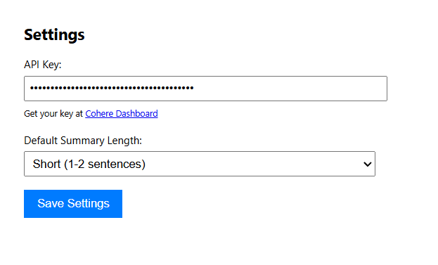
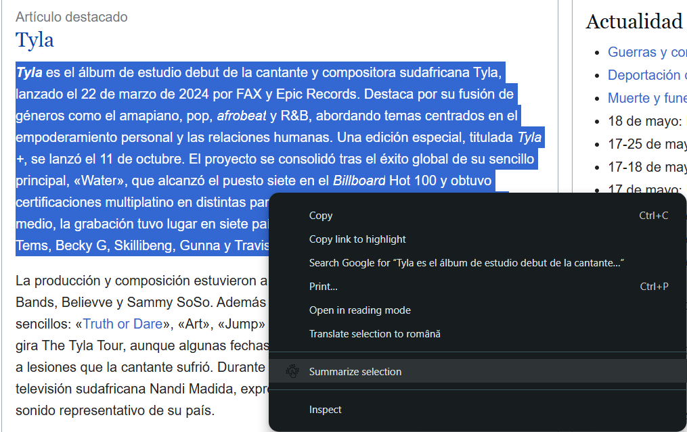
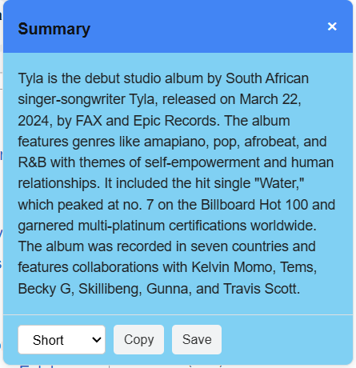
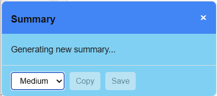
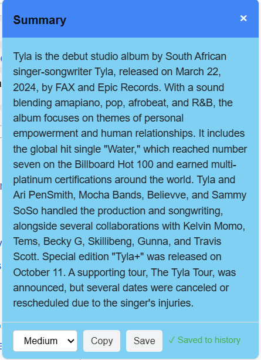
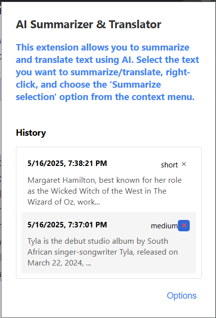
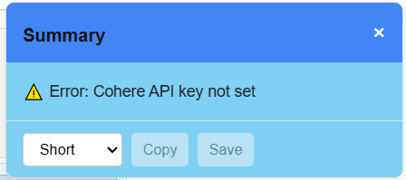

# AI Content Summarizer Chrome Extension

AI Content Summarizer is a Chrome extension that summarizes the selected text in a webpage and translates it to English (if it is written in another language) using Cohere's AI

## Overview

Purpose: Quickly generate summaries (in English) of selected webpage text

✨ Key Features of the extension:

- **Right-click context menu integration**
- **Customizable summary lengths (short/medium/long)**
- **Multilingual support (output summary in English)**
- **Summary history tracking**
- **Copy/Save functionality of the generated summary**

## Installation

The extension can be installed for local development/testing (Chrome only) from the GitHub repository

**1. Get the extension files by one of the 2 methods**:

- Clone from GitHub:

```bash
git clone https://github.com/913-groza-vlad/ai_summarizer.git
```

- Download ZIP

```
Click Code → Download ZIP on Github
Extract the ZIP file
```

**2. Load in Chrome**

- Navigate to `chrome://extensions`
- Enable Developer mode
- Click "Load unpacked"
- Select the extracted folder

## Setup

After installation:

- Click the extension icon (🧩) in Chrome's toolbar
- Select "Options"
- Enter your Cohere API key (a trial key can be generated from Cohere Dashboard)
- Configure default summary length



## Usage/Example

To generate and manage summaries the following steps can be followed:

- **Generate a summary**

  1. Select the text you want to summarize
  2. Right-click and select "Summarize selection" from the context menu

     

  3. A summary of the length set from the options page (short in this case) is generated and displayed on the screen

     

- **Regenerate summary by adjusting summary length**:

  1. Use the dropdown to switch between:
     - Short (1-2 sentences)
     - Medium (3-5 sentences)
     - Long (6-8 sentences)
  2. The extension will regenerate the summary

     

  3. The newly generated content is displayed:

     

- **Copy, save and manage summaries**

  - Click 'Copy' button to save the summary to clipboard
  - Click 'Save' button to store the content in the history list, which contains previously saved summaries (A message can be seen if the save action is completed successfully)
  - Access saved summaries by clicking on the extension icon. A popup appears where we can visualize the summaries stored. These elements can be expanded to view the full summary text, but we can also delete a summary if it is not needed anymore

    

- **Error handling**:
  If there is an error when we try to generate a summary, a clear error message is displayed, so the user is aware of the reason for which the content was not generated. Usually, the errors are caused by exceeding the usage limit in case of a trial key and by setting an incorrect key or not setting a key at all (this is the situation in the image below).

  

## 🧠 Technical Details

**Manifest Configuration**

Extension setup and permissions:

- manifest_version: 3 (Modern Chrome Extensions API)
- name/description: Publicly visible in Chrome Web Store
- icons: Responsive sizes for Chrome UI (toolbar, menus, store)

#### Key Components

| Field           | Purpose                        | Location                       |
| --------------- | ------------------------------ | ------------------------------ |
| action          | Browser toolbar button + popup | popup/popup.html               |
| options_page    | User settings UI               | options/options.html           |
| background      | Long-lived processes           | background.js (service worker) |
| content_scripts | Injected into web pages        | content.js                     |

| Permission                | Used For                                  |
| ------------------------- | ----------------------------------------- |
| `storage`                 | Save user preferences and summary history |
| `contextMenus`            | Right-click integration                   |
| `scripting`               | Dynamic content script injection          |
| `https://api.cohere.ai/*` | AI API calls                              |

**Background Script**

Handles API calls, context menu clicks and saving items into the history list

- API Integration

  Uses Cohere's /v1/summarize endpoint in the async function `callCohereAPI`

  ```javascript
  const response = await fetch('https://api.cohere.ai/v1/summarize', {
    method: 'POST',
    headers: {
      Authorization: `Bearer ${cohereKey}`,
      'Content-Type': 'application/json',
      Accept: 'application/json',
    },
    body: JSON.stringify({
      text: text,
      length: lengthMap[options.length] || 'medium',
      format: 'paragraph',
      model: 'command',
      temperature: 0.3,
      additional_command:
        'Summarize the selected content in English regardless of original language of the text.',
    }),
  });
  ```

- Context Menu Click event

  Listens for clicks on the "summarize-selection" context menu item and sends the selected text and length to the content script for processing

  ```javascript
  chrome.contextMenus.onClicked.addListener(async (info, tab) => {
    if (info.menuItemId === 'summarize-selection' && info.selectionText) {
      const { summaryLength } = await chrome.storage.sync.get([
        'summaryLength',
      ]);
      chrome.scripting
        .executeScript({
          target: { tabId: tab.id },
          files: ['content.js'],
        })
        .then(() => {
          chrome.tabs.sendMessage(tab.id, {
            action: 'summarize',
            text: info.selectionText,
            length: summaryLength || 'medium',
          });
        });
    }
  });
  ```

**Content Script**

Handles UI rendering (box with the generated summary) and user interactions

- `showSummaryUI` function creates the summary popup DOM element, manages button states (copy/save disabled during errors) and listens for length changes

  ```javascript
  function showSummaryUI(summary, text, initialLength) {
      ...
  }
  ```

- `generateSummary` asynchronous function communicates with background script for processing the Cohere API request

  ```javascript
  async function generateSummary(text, length) {
    try {
      const response = await chrome.runtime.sendMessage({
        action: 'callCohere',
        text: text,
        options: { length },
      });
      if (response.success) {
        return response.summary;
      } else {
        throw new Error(response.error);
      }
    } catch (error) {
      return `⚠️ Error: ${error.message}`;
    }
  }
  ```

**Options Page**

The code in the `options.js` file handles the options page's functionality with these key actions

- Loads saved settings (cohereKey and summaryLength) from Chrome's sync storage when the page opens
- When clicking 'Save': the new API key and length preference are stored, broadcasts the updated length setting to all open tabs and shows a "Settings saved!" confirmation for 2 seconds

**Extension popup**

In `popup.js`, we handle the extension's popup interface and history operations:

✔ Dynamic Loading

- Displays recent summaries with timestamps
- Auto-updates when new summaries are saved

✔ Interactive Controls

- Expand/collapse long summaries
- One-click deletion

✔ Storage Sync

- Maintains history list across browser sessions
- Limited to 5 most recent entries

## Support

For support, report issues at: https://github.com/913-groza-vlad/ai_summarizer

Cohere API support: [support@cohere.com]
